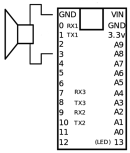

Teensy 3 (MK20DX256VLH7) Tone Morse demo
========================================

Libraries
---------

This minimal example uses no external library:
no [MBED](https://www.mbed.com/en/) SDK, no Arduino, no Teensyduino

Though follows files are borrowed from [MBED](https://www.mbed.com/en/) project
- Device specific configuration files:
  * [system_MK20DX256.c](https://github.com/mbedmicro/mbed/blob/master/libraries/mbed/targets/cmsis/TARGET_Freescale/TARGET_K20XX/TARGET_TEENSY3_1/system_MK20DX256.c) and [system_MK20DX256.h](https://github.com/mbedmicro/mbed/blob/master/libraries/mbed/targets/cmsis/TARGET_Freescale/TARGET_K20XX/TARGET_TEENSY3_1/system_MK20DX256.h)
- CMSIS Peripheral Access Layer header:
  * [MK20DX256.h](https://github.com/mbedmicro/mbed/blob/master/libraries/mbed/targets/cmsis/TARGET_Freescale/TARGET_K20XX/TARGET_TEENSY3_1/MK20DX256.h)
- Linker script : 
  * [MK20DX256.ld](https://github.com/mbedmicro/mbed/blob/master/libraries/mbed/targets/cmsis/TARGET_Freescale/TARGET_K20XX/TARGET_TEENSY3_1/TOOLCHAIN_GCC_ARM/MK20DX256.ld)
- Startup file for Cortex-M4 devices:
  * [startup_MK20DX256.S](https://github.com/mbedmicro/mbed/blob/master/libraries/mbed/targets/cmsis/TARGET_Freescale/TARGET_K20XX/TARGET_TEENSY3_1/TOOLCHAIN_GCC_ARM/startup_MK20DX256.S)

And Makefile is coming from [MBED](https://www.mbed.com/en/) GCC Makefile templates

Pinouts
-------

We'll use Teensy port 3 (for tone) and port 13 (for led) which are connected to MK20DX256VLH7 Pin 28 and Pin 50.




(Source: [PJRC](https://www.pjrc.com/teensy/schematic3.gif))


| 64 LQFP _QFN | Pin Name | Default | ALT0 |  ALT1 |  ALT2  |    ALT3   |   ALT4  |  ALT5 |   ALT6 |
|----|----------|---------|------|-------|--------|-----------|---------|-------|--------|
| 28 | PTA12 | CMP2_IN0 | CMP2_IN0 | PTA12 | CAN0_TX | FTM1_CH0 |      |   | I2S0_TXD0 |
| 50 | PTC5/LLWU_P9    |DISABLED |      |PTC5/LLWU_P9  |SPI0_SCK|LPTMR0_ALT2|I2S0_RXD0|FB_AD10|CMP0_OUT|

(Source: K20 Sub-Family Reference Manual
10.3.1 K20 Signal Multiplexing and Pin Assignments)

Code explenation
---------------
Before using any GPIO pin (here PTA and resp. PTC refers to Port A and Port C), clock gate need to be enabled by setting PORTA field (bit 9) and PORTC field (bit 11) of SIM_SCGC5 register.
```c
SIM->SCGC5 = SIM_SCGC5_PORTA_MASK |
             SIM_SCGC5_PORTC_MASK;
```

To make pin 28 run as *PWM* and 50 run as *GPIO* we need to select Alternative 1 for MUX field (bit 10-8) of PORTA_PCR12 and PORTC_PCR5 registers
```c
PORTA->PCR[12] = PORT_PCR_MUX(3); // FTM1_CH0
PORTC->PCR[5] = PORT_PCR_MUX(1);  // PTC5
```

Alternativly we switch the led on and off, by writing bit 5 of GPIOC_PSOR (resp. GPIOC_PCOR) register
```c
PTC->PSOR = (1<<5);
PTC->PCOR = (1<<5);
```

Tone is emited when FTM1/Ch0 duty cycle is set to half of period
```
FTM1->CONTROLS[0].CnV = FTM1->MOD/2;
```
Set the duty cycle to low value to disable tone
```
FTM1->CONTROLS[0].CnV = 1;
```

```c
SysTick_Config(SystemCoreClock / 1000) != 0
```
will generate an interrupt every 1ms and call *SysTick_Handler* which only increments *msTicks*
```c
volatile unsigned long msTicks
```
used for our *wait* function. **volatile**,  so the empty loop is not optimised (ie removed) by the compilator.

Algorithm
---------

Adapted from [rosettacode.org](http://rosettacode.org/wiki/Morse_code)

Makefile
-----------

Option ```--specs=nosys.specs``` is used and no C libraries linked to make the .hex files the smallest

Compilation
-----------

gcc version 4.9.3 20150529 (release) (GNU Tools for ARM Embedded Processors) 

```
cd morse_tone
make
```

References
----------
I've used information from this project too.
[Four-channel RGB driver board using a Teensy 3.1](http://www.seanet.com/~karllunt/4chanRGBDriverTeensy31.html)
